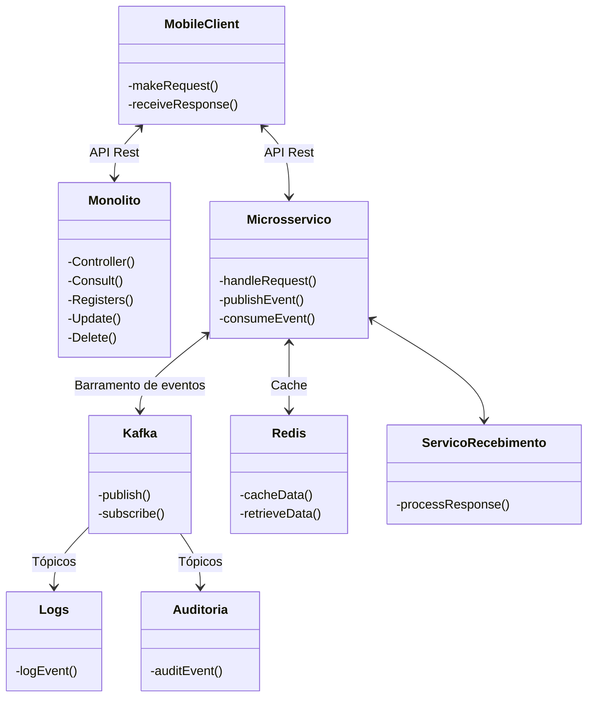

Projeto de Estudo: Arquitetura de Microsserviços com Spring Boot e Kafka

Este projeto de estudo tem como objetivo explorar a arquitetura de microsserviços, utilizando Spring Boot para construir serviços RESTful e Kafka como barramento de eventos para comunicação assíncrona entre os serviços. O projeto também integra um monólito legado, demonstrando como realizar a migração gradual para microsserviços.

### Arquitetura

A arquitetura do projeto é composta por três componentes principais:

1. **Monólito Legado:** Representa um sistema existente com funcionalidades agrupadas em um único bloco. O projeto demonstra como integrar o monólito com a nova arquitetura de microsserviços.

2. **Microsserviços:**
   * **Serviços RESTful:** Implementados com Spring Boot, cada microsserviço é responsável por uma funcionalidade específica do sistema, como cadastro, consulta, atualização e exclusão de dados.
   * **Barramento de Eventos (Kafka):** Permite a comunicação assíncrona entre os microsserviços por meio da publicação e consumo de eventos.

3. **Cliente Mobile:**
   * Interage com os microsserviços por meio de APIs REST.
   * Utiliza o barramento de eventos para receber notificações sobre alterações no sistema.

### Fluxo de Trabalho

1. O cliente mobile envia uma requisição para um microsserviço através da API REST.
2. O microsserviço processa a requisição e, se necessário, publica um evento no barramento do Kafka.
3. Outros microsserviços interessados no evento o consomem e executam as ações correspondentes.
4. O microsserviço que recebeu a requisição original envia uma resposta para o cliente mobile.
5. Serviços auxiliares, como Logs e Auditoria, consomem eventos para registrar informações relevantes.
6. O cache Redis é utilizado para otimizar consultas frequentes.

### Tecnologias Utilizadas

* **Java 17:** Linguagem de programação principal.
* **Spring Boot 3:** Framework para desenvolvimento de aplicações Java.
* **Spring Data JPA:** Simplifica o acesso a dados em bancos de dados SQL.
* **Kafka:** Barramento de eventos distribuído.
* **Redis:** Banco de dados em memória para cache.
* **OpenAPI (Swagger):** Geração de documentação interativa da API.
* **Railway:** Plataforma para implantação e gerenciamento na nuvem.

### Próximos Passos

* Implementar os microsserviços utilizando Spring Boot.
* Configurar o Kafka para o barramento de eventos.
* Integrar o monólito legado com os microsserviços.
* Desenvolver o cliente mobile para interagir com a API.
* Implementar os serviços auxiliares (Logs, Auditoria) e o cache Redis.
* Realizar testes unitários e de integração.
* Implantar a aplicação na nuvem utilizando o Railway.


### Estrutura de pastas
```
Projeto de Estudo/
├── user-service/                 
│   ├── src/
│   │   ├── main/
│   │   │   ├── java/
│   │   │   │   └── com.santander.devweek.userservice
│   │   │   │       ├── controller/
│   │   │   │       ├── dto/
│   │   │   │       ├── entity/
│   │   │   │       ├── repository/
│   │   │   │       └── service/
│   │   └── resources/
│   │       └── application.yml
│   ├── pom.xml
│   └── Dockerfile
├── account-service/
│   ├── ... (estrutura similar ao user-service)
├── feature-service/
│   ├── ...
├── card-service/
│   ├── ...
├── news-service/
│   ├── ...
├── api-gateway/                  
│   ├── ...
├── config-server/                
│   ├── ...
├── service-discovery/            
│   ├── ...
├── monitoring-service/           
│   ├── ...
└── docker-compose.yml
```

## Diagrama de Relação Java Spring Boot e Kafka

[](https://github.com/LeonardoJaques/java-kafka/blob/main/como_relacionar_Java_Spring_Boot%20_Kafka.drawio.png)


### Diagrama de classes



### Contribuições

Contribuições são bem-vindas! Sinta-se à vontade para abrir issues e pull requests.
